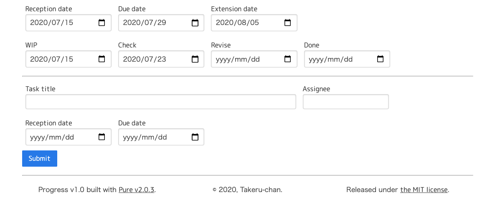

# Progress
A simple bar chart like a poor gantt chart.  

## What's this? | これはなに？
対外的にチームの進捗状況を可視化するために作った低機能版ガントチャートです。ガントチャート自体は色々なWebサービスがあるのだけれど、そこまで高機能なものは要らないので作ってみました。  

当初は[ihgsさんのyaml2gantt](https://github.com/ihgs/yaml2gantt)を使うつもりだったものの、npmでインストールしようとしたらMac以外ではPhantomJSのエラーで上手くいかなかったので、悩むより作った方が早かった。  

[デモサイト](https://progress.takeru-chan.com/)はこちら。  
※デモサイトではセッションごとにデータ管理しているため、他者とのデータ共用はできません。  

## Usage | 使い方
`progress.php`をWebサーバー上に置くだけ。データベース不要。PHPは7以降なら多分動く。以下環境で動作確認済。  

- FreeBSD 12.1
- nginx 1.18.0
- PHP 7.4.8


メインはチャート画面。タスク名と担当者名、タスク対応期間をあらわすバーチャート、着手日や完了日などのイベントをタスクごとに表示します。表示期間は今月と来月の２ヶ月間。休日は土日固定。  

タスクの状態に応じてバーチャートの色が変わります。規定値は以下のとおり。  

- 未着手：紫
- 着手済：青 ... WIPに日付が設定済
- 確認中：薄緑 ... Checkに日付が設定済
- 修正中：緑 ... Reviseに日付が設定済
- 完了：灰色 ... Doneに日付が設定済
- 中断：黒 ... Assigneeに`Suspend`または`中断`を指定

### タスクデータ
`progress.php`と同じディレクトリにある`progress.json`ファイルで指定します。フォーマットは以下のとおり。  

```
[
...
{
  "title":"Task is Done (Done is grey)",
  "assignee":"Joe",
  "start":1593615600,
  "end":1595343600,
  "extend":null,
  "study":1593615600,
  "check":1594134000,
  "revise":1594566000,
  "issued":1594911600
},
...
]
```

タスク対応期間やイベントの日付などはunixtimeで指定します。unixtimeの計算や、そもそもjsonファイルの作成は面倒なのでリスト表示画面でタスクの入力や編集ができるようになっています。  


既存のタスクに対して、WIP / Check / Revise / Doneなどのイベント日付の入力や修正ができます。タスク名(Task title)や担当者(Assignee)、タスク対応期間の開始日(Reception date)や期限(Due date)の修正も可能。期限延長(Extesion date)を入力するとDue date以降のバーチャートが破線で追加されます。  



新規タスクはリスト表示の最下部にブランクの項目があるのでタスク名や担当者、タスク対応期間を入力することで追加することができます。  

既存タスクの編集や新規タスクの登録は、フォームに記入後Submitボタンを押すことで書き込みが完了します。Submitボタンを押さずにページ切り替えをすると編集内容は失われます。  

タスクの削除はタスク名を空欄にしてSubmitボタンを押します。  

### 設定ファイル
土日以外の祝日などは`progress.php`と同じディレクトリにある`holiday.txt`で指定します。休日をYYYYMMDDフォーマットで書き連ねるだけ。  

```
...
20200723
20200724
20200810
...
```

`progress.php`と同じディレクトリに`progress.conf`という設定ファイルを置くと、サービス名やタスクの設定項目名、バーチャートの色などを変更することができます。設定は下記jsonフォーマットを参照してください。  

```
{
  "service_name":"Progress",
  "list_label":"Change List view",
  "chart_label":"Change Chart view",
  "task_title":"Task title",
  "assignee":"Assignee",
  "reception":"Reception date",
  "duedate":"Due date",
  "extension":"Extension date",
  "suspend":"Suspend",
  "suspend_color":"#000000",
  "notstart_color":"#cc99ff",
  "workinprogress":"WIP",
  "wip_color":"#00ccff",
  "check":"Check",
  "check_color":"#00ff99",
  "revise":"Revise",
  "revise_color":"#00ff33",
  "done":"Done",
  "done_color":"#c0c0c0",
  "submit":"Submit"
}
```

実際にはjsonファイルを作るのは面倒なので、Settingsリンクをクリックすることで設定画面に移動します。それぞれの値を書き換えたらSubmitボタンを押すと保存されます。Clearボタンを押すと全ての値がデフォルトに戻ります。  


もともと営業からの作図依頼をこなすのに使うつもりなので、こんな感じの設定値になっています。  

## Lisense
This code has released under the MIT license.  
[http://opensource.org/licenses/MIT](http://opensource.org/licenses/MIT)  

## One more thing...
もしもこのプログラムがあなたの役に立ったなら、[ビールを一杯奢って](https://www.paypal.com/paypalme/takeru68/500JPY)貰えるとすごく嬉しいです。(//∇//)
